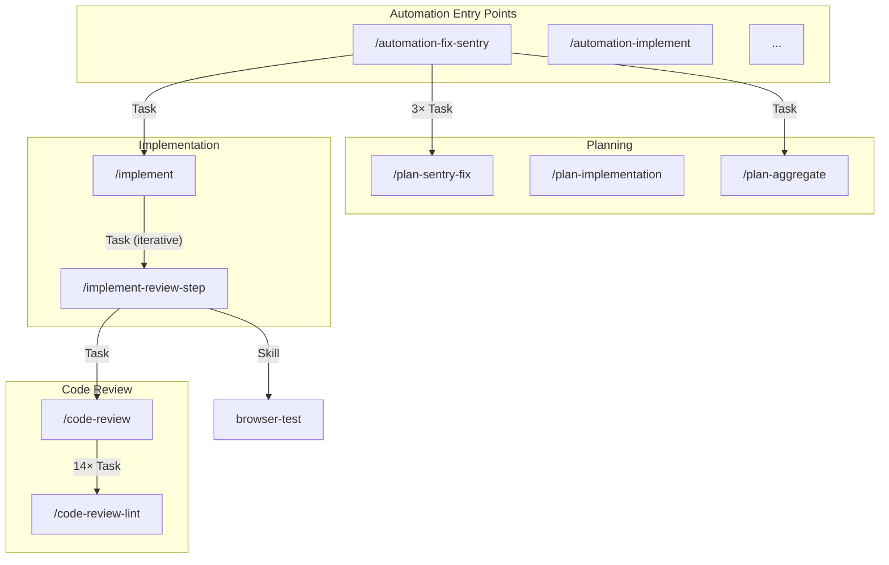

# Command Overview

This command analyzes all slash commands in `.claude/commands/` and generates a visual overview diagram showing how they relate to each other, including which commands call other commands directly or as subthreads.

## Process

### Step 1: Discover All Commands

List all `.md` files in `.claude/commands/` to discover available slash commands.

### Step 2: Analyze Each Command

For each command file, extract:

1. **Command name**: From the filename (e.g., `automation-fix-sentry.md` → `/automation-fix-sentry`)
2. **Description**: From the YAML frontmatter `description` field
3. **Called commands**: Search for patterns like:
   - `Run the /command-name skill` or `Run /command-name` (Task-based subthread calls)
   - `Skill(skill="command-name")` or `Skill tool` with skill names (direct skill calls)
   - `/command-name` in instructional text indicating subthread delegation
4. **Execution context**: Determine if calls are:
   - **Task (subthread)**: Runs in isolated context via `Task` tool
   - **Skill (direct)**: Runs in same thread via `Skill` tool
   - **Parallel**: Multiple simultaneous Task calls

### Step 3: Build Relationship Map

Create a structured map of all command relationships:

```
{
  "command-name": {
    "description": "...",
    "calls": [
      { "target": "other-command", "type": "task|skill", "parallel": true|false, "count": N }
    ],
    "called_by": ["parent-command-1", "parent-command-2"]
  }
}
```

### Step 4: Generate Mermaid Diagram

Create a Mermaid flowchart diagram with:

- **Subgraphs** to group related commands:
  - `Automation Entry Points` - Top-level automation commands
  - `Planning` - Plan creation and aggregation
  - `Implementation` - Code implementation
  - `Code Review` - All code review commands
  - `Testing` - Browser/UI testing
  - `Utilities` - Other helper commands

- **Node styling**:
  - Entry points: Rounded rectangles with bold borders
  - Leaf commands (no children): Simple rectangles
  - Orchestrators (call multiple): Double-bordered rectangles

- **Edge styling**:
  - Solid arrows for Task (subthread) calls
  - Dashed arrows for Skill (direct) calls
  - Labels showing `N×` for parallel calls (e.g., `3×` for 3 parallel)

### Step 5: Save Output

Save the diagram to `.claude/review/command-overview.md` with:

1. **Summary statistics**:
   - Total commands
   - Entry points (not called by others)
   - Leaf commands (don't call others)
   - Max depth of call chain

2. **Mermaid diagram** (can be rendered in VS Code, GitHub, etc.)

3. **Command reference table**:
   | Command | Description | Calls | Called By |
   |---------|-------------|-------|-----------|

4. **Call chain analysis**:
   - Longest execution paths
   - Commands with most subthreads

## Example Output Structure

````markdown
# Slash Command Overview

Generated: [timestamp]

## Summary

- **Total Commands**: 28
- **Entry Points**: 7 (automation-fix-sentry, automation-implement, ...)
- **Leaf Commands**: 15 (code-review-lint, browser-test, ...)
- **Max Call Depth**: 4

## Diagram



## Command Reference

| Command                | Description                   | Calls                                              | Called By                                       |
| ---------------------- | ----------------------------- | -------------------------------------------------- | ----------------------------------------------- |
| /automation-fix-sentry | Fix Sentry issues             | plan-sentry-fix (3×), plan-aggregate, implement | -                                               |
| /code-review           | Main code review orchestrator | 14 sub-reviews                                     | implement-review-step, implement-review-loop, ... |
| ...                    | ...                           | ...                                                | ...                                             |

## Call Chain Analysis

### Longest Execution Paths

1. `/automation-fix-sentry` → `/plan-sentry-fix` → (exploration)
2. `/automation-fix-sentry` → `/plan-aggregate` → (analysis)
3. `/automation-fix-sentry` → `/implement` → `/implement-review-step` → `/code-review` → 14 sub-reviews
4. `/automation-fix-sentry` → `/implement` → `/implement-review-step` → `/browser-test`

### Commands with Most Subthreads

1. `/code-review` - 14 parallel Task subagents
2. `/automation-fix-sentry` - 3 parallel + 2 sequential Task subagents
3. `/automation-implement` - 3 parallel + 2 sequential Task subagents
````

## Output

After completing the analysis:

1. **Diagram saved to**: `.claude/review/command-overview.md`
2. **Display the Mermaid diagram** in the response for immediate viewing
3. **Highlight key insights**:
   - Which entry points are most complex
   - Which commands are called most frequently
   - Any orphaned commands (not called by anything, don't call anything)

## Notes

- The Mermaid diagram can be viewed in VS Code with the Mermaid extension, on GitHub, or at mermaid.live
- Commands that use `Task` tool create isolated subthreads with their own context
- Commands that use `Skill` tool run in the same context as the caller
- Parallel Task calls (`run_in_background: true`) execute simultaneously
