# Slash Command Overview

Generated: 2026-01-26

## Summary

- **Total Commands**: 25
- **Entry Points**: 8 (commands not called by others)
- **Leaf Commands**: 17 (commands that don't call others)
- **Orchestrator Commands**: 4 (commands that call multiple sub-commands)
- **Max Call Depth**: 3

## Diagram

```mermaid
flowchart TD
    subgraph Entry["Entry Points"]
        review-pr(["/review-pr"])
        implement-issue(["/implement-issue"])
        create-pr(["/create-pr"])
        fix-pr(["/fix-pr"])
        automate-request(["/automate-request"])
        fix-sentry-issue(["/fix-sentry-issue"])
        implement-review-loop(["/implement-review-loop"])
        command-overview(["/command-overview"])
    end

    subgraph Planning["Planning"]
        plan-aggregate["/plan-aggregate"]
    end

    subgraph Implementation["Implementation"]
        implement["/implement"]
    end

    subgraph CodeReview["Code Review"]
        code-review[["/code-review"]]
        code-review-guidelines["/code-review-guidelines"]
        code-review-tests["/code-review-tests"]
        code-review-lint["/code-review-lint"]
        code-review-typecheck["/code-review-typecheck"]
        code-review-security["/code-review-security"]
        code-review-trpc["/code-review-trpc"]
        code-review-logic["/code-review-logic"]
        code-review-readability["/code-review-readability"]
        code-review-dry["/code-review-dry"]
        code-review-frontend["/code-review-frontend"]
        code-review-ux["/code-review-ux"]
        code-review-redundancies["/code-review-redundancies"]
        code-review-specific-ignores["/code-review-specific-ignores"]
        code-review-coderabbit["/code-review-coderabbit"]
    end

    %% Entry point connections
    review-pr -.->|"Skill"| code-review
    implement-issue -.->|"Skill"| code-review
    implement-review-loop -->|"Task"| code-review

    %% Automate-request flow
    automate-request -->|"3x Task"| plan-aggregate
    automate-request -.->|"Skill"| plan-aggregate
    automate-request -.->|"Skill"| implement

    %% Code review orchestration (13 parallel Task calls)
    code-review -->|"13x Task"| code-review-guidelines
    code-review -->|"13x Task"| code-review-tests
    code-review -->|"13x Task"| code-review-lint
    code-review -->|"13x Task"| code-review-typecheck
    code-review -->|"13x Task"| code-review-security
    code-review -->|"13x Task"| code-review-trpc
    code-review -->|"13x Task"| code-review-logic
    code-review -->|"13x Task"| code-review-readability
    code-review -->|"13x Task"| code-review-dry
    code-review -->|"13x Task"| code-review-frontend
    code-review -->|"13x Task"| code-review-ux
    code-review -->|"13x Task"| code-review-redundancies
    code-review -->|"13x Task"| code-review-specific-ignores

    %% Styling
    classDef entryPoint fill:#e1f5fe,stroke:#01579b,stroke-width:2px
    classDef orchestrator fill:#fff3e0,stroke:#e65100,stroke-width:3px
    classDef leaf fill:#f3e5f5,stroke:#7b1fa2
    classDef planning fill:#e8f5e9,stroke:#2e7d32

    class review-pr,implement-issue,create-pr,fix-pr,automate-request,fix-sentry-issue,implement-review-loop,command-overview entryPoint
    class code-review,automate-request orchestrator
    class code-review-guidelines,code-review-tests,code-review-lint,code-review-typecheck,code-review-security,code-review-trpc,code-review-logic,code-review-readability,code-review-dry,code-review-frontend,code-review-ux,code-review-redundancies,code-review-specific-ignores,code-review-coderabbit,create-pr,fix-pr,fix-sentry-issue,command-overview leaf
    class plan-aggregate,implement planning
```

## Command Reference

| Command | Description | Calls | Called By |
|---------|-------------|-------|-----------|
| /review-pr | Review a GitHub PR for code quality and guideline compliance | code-review (Skill) | - |
| /implement-issue | Implement a GitHub issue end-to-end | code-review (Skill) | - |
| /create-pr | Create a GitHub PR for current changes | - | - |
| /fix-pr | Fix PR issues based on unresolved comments | - | - |
| /automate-request | Automate complex requests using parallel investigation | 3x Task agents, plan-aggregate (Skill), implement (Skill) | - |
| /fix-sentry-issue | Fix Sentry issues | - | - |
| /implement-review-loop | Iteratively run code review and fix findings | code-review (Task) | - |
| /implement | Implement features from a plan | Task agent | automate-request |
| /plan-aggregate | Review and fuse multiple implementation plans | - | automate-request |
| /code-review | Review code for quality and guideline compliance | 13 sub-reviews (Task, parallel) | review-pr, implement-issue, implement-review-loop |
| /code-review-guidelines | Reviews code for CLAUDE.md compliance | - | code-review |
| /code-review-tests | Runs test suite | - | code-review |
| /code-review-lint | Runs Biome linting | - | code-review |
| /code-review-typecheck | Runs TypeScript type checking | - | code-review |
| /code-review-security | Reviews code for security vulnerabilities | - | code-review |
| /code-review-trpc | Reviews tRPC routers for performance and patterns | - | code-review |
| /code-review-logic | Reviews game logic for correctness and safety | - | code-review |
| /code-review-readability | Reviews code for readability and clarity | - | code-review |
| /code-review-dry | Reviews code for duplication | - | code-review |
| /code-review-frontend | Reviews React/TSX components for best practices | - | code-review |
| /code-review-ux | Reviews code for UX quality | - | code-review |
| /code-review-redundancies | Reviews code for redundant additions and orphaned code | - | code-review |
| /code-review-specific-ignores | Reviews code for overly broad error ignores | - | code-review |
| /code-review-coderabbit | Runs CodeRabbit analysis | - | - |
| /command-overview | Generate overview diagram of all slash commands | - | - |

## Call Chain Analysis

### Longest Execution Paths

1. `/review-pr` → `/code-review` → 13 parallel sub-reviews
2. `/implement-issue` → `/code-review` → 13 parallel sub-reviews
3. `/implement-review-loop` → `/code-review` → 13 parallel sub-reviews
4. `/automate-request` → `/plan-aggregate` → (analysis)
5. `/automate-request` → `/implement` → (self-evaluation loop)

### Commands with Most Subthreads

1. `/code-review` - 13 parallel Task subagents (all code review sub-commands)
2. `/automate-request` - 3 parallel investigation Task agents + 2 sequential Skill calls

### Command Categories

**Entry Points (8)** - Commands invoked directly by users:
- `/review-pr` - PR review workflow
- `/implement-issue` - Full issue implementation workflow
- `/create-pr` - Simple PR creation
- `/fix-pr` - Fix unresolved PR comments
- `/automate-request` - Complex automation orchestration
- `/fix-sentry-issue` - Sentry error fix workflow
- `/implement-review-loop` - Iterative review-fix cycle
- `/command-overview` - This documentation generator

**Orchestrators (2)** - Commands that coordinate multiple sub-commands:
- `/code-review` - Orchestrates 13 parallel review agents
- `/automate-request` - Orchestrates planning, aggregation, and implementation

**Planning (1)**:
- `/plan-aggregate` - Synthesizes multiple implementation plans

**Implementation (1)**:
- `/implement` - Executes implementation with self-evaluation

**Code Review Leaf Commands (14)** - Specialized review tasks:
- Guidelines, Tests, Lint, Typecheck, Security, tRPC, Logic, Readability, DRY, Frontend, UX, Redundancies, Specific-Ignores, CodeRabbit

**Standalone (4)** - Commands that neither call nor are called by others:
- `/create-pr` - Simple utility
- `/fix-pr` - Simple utility
- `/fix-sentry-issue` - Self-contained workflow
- `/command-overview` - Documentation only

## Architecture Insights

### High-Level Workflows

1. **PR Review Flow**: `/review-pr` → `/code-review` → 13 parallel checks
2. **Issue Implementation Flow**: `/implement-issue` → implementation → `/code-review`
3. **Automation Flow**: `/automate-request` → 3 parallel plans → `/plan-aggregate` → `/implement`
4. **Quality Loop**: `/implement-review-loop` → `/code-review` → fix → repeat

### Design Patterns

- **Parallel Execution**: `/code-review` and `/automate-request` leverage parallel Task agents for efficiency
- **Skill vs Task**: Skill calls run in same context (e.g., `/review-pr` → `/code-review`); Task calls create isolated subthreads
- **Isolation for Heavy Work**: Code review runs in Task subthread to prevent context bloat
- **Self-Evaluation**: `/implement` uses iterative self-evaluation loop before completing

### Edge Styling Legend

- **Solid arrows (→)**: Task tool calls (isolated subthread)
- **Dashed arrows (-.->)**: Skill tool calls (same context)
- **Nx**: Parallel execution count
